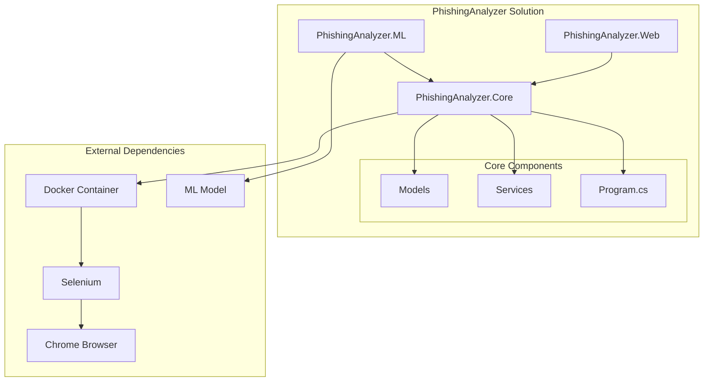

# Phishing Website Analyzer

A comprehensive .NET application that analyzes websites for potential phishing threats using multiple analysis methods including machine learning, web scraping, and pattern detection.

## Features

- URL analysis in an isolated Docker container
- ML.NET-based phishing detection with FastTree algorithm
- JavaScript error and warning detection
- HTTPS verification
- Suspicious pattern detection (login forms, redirects, etc.)
- Screenshot capture
- Risk scoring system
- Web interface for easy analysis
- RESTful API endpoints
- Extensible analysis framework

## Project Components

### PhishingAnalyzer.Core
The core analysis engine that provides:
- Website content analysis
- Pattern detection
- Risk scoring
- Docker container management
- Selenium-based web scraping
- Real-time website monitoring
- Content extraction and analysis
- Network request tracking
- SSL certificate validation

### PhishingAnalyzer.ML
Advanced machine learning component using ML.NET that provides:
- FastTree-based phishing detection model
- Comprehensive feature extraction including:
  - URL structure analysis
  - Domain characteristics
  - Suspicious word detection
  - Protocol validation
  - TLD analysis
  - IP address detection
  - Special character analysis
  - Case pattern analysis
- Real-time classification with probability scores
- Model training capabilities
- Support for model updates
- Feature importance analysis
- Batch prediction support

#### ML Features
The ML component analyzes URLs using the following features:
1. Basic URL Features:
   - URL length
   - Special character count
   - Digit count
   - Uppercase letter count
   - Suspicious word presence

2. URL Structure Features:
   - Protocol validation
   - Domain validation
   - Domain length
   - Path length
   - Query parameter length

3. Security Features:
   - IP address presence
   - Suspicious TLD detection
   - Suspicious word ratio
   - Protocol security (HTTP vs HTTPS)

### PhishingAnalyzer.Web
Modern web interface and API that provides:
- User-friendly web interface
- RESTful API endpoints
- Analysis history
- Real-time analysis results
- Batch URL analysis
- Interactive dashboard
- Detailed analysis reports
- Export capabilities
- User authentication
- API key management

## Prerequisites

- .NET 9.0 SDK
- Docker Desktop
- Chrome browser (for local development)

## Installation

1. Clone the repository
2. Install Docker Desktop and ensure it's running
3. Build the solution:
   ```bash
   dotnet build
   ```

## Usage

### Command Line Interface
Run the analyzer from the command line:
```bash
dotnet run --project PhishingAnalyzer.Core/PhishingAnalyzer.Core.csproj "https://example.com"
```

### Web Interface
Start the web application:
```bash
dotnet run --project PhishingAnalyzer.Web/PhishingAnalyzer.Web.csproj
```
Then access the web interface at `http://localhost:5000`

### API Endpoints
The following RESTful endpoints are available:
- `POST /api/analyze` - Analyze a single URL
- `POST /api/analyze/batch` - Analyze multiple URLs
- `GET /api/history` - Get analysis history
- `GET /api/analysis/{id}` - Get specific analysis results

## Analysis Criteria

The analyzer evaluates websites based on several factors:

- HTTPS usage
- JavaScript errors and warnings
- Suspicious patterns (login forms, redirects)
- Script sources
- Network requests
- Machine learning predictions
- Domain age and registration
- SSL certificate validity
- Content similarity to known phishing sites

## Risk Scoring

The risk score is calculated based on:

- Non-HTTPS connection (30 points)
- JavaScript errors (5 points each)
- Warnings (2 points each)
- Suspicious patterns (10 points each)
- ML model prediction (0-100 points)
- Domain age < 1 year (15 points)
- Invalid SSL certificate (25 points)
- Content similarity to known phishing sites (20 points)

Risk levels:
- Low: < 30
- Medium: 30-59
- High: 60-79
- Critical: ≥ 80

## Project Structure

```
PhishingAnalyzer/
├── PhishingAnalyzer.Core/         # Core analysis engine
│   ├── Models/                    # Data models
│   ├── Services/                  # Analysis services
│   └── Program.cs                 # Console application entry point
├── PhishingAnalyzer.ML/          # ML.NET-based ML component
│   ├── Models/                    # ML models
│   ├── Features/                  # Feature extraction
│   │   ├── UrlFeatures.cs        # URL feature definitions
│   │   ├── UrlFeatureExtractor.cs # Feature extraction logic
│   │   └── UrlFeatureExtractionFactory.cs # Feature factory
│   └── Services/                  # ML services
├── PhishingAnalyzer.Web/         # Web interface and API
│   ├── Controllers/              # API controllers
│   ├── Views/                    # Web interface views
│   └── wwwroot/                  # Static files
└── phishing_model.zip            # Pre-trained ML model
```

## Architecture Diagram



## Contributing

1. Fork the repository
2. Create a feature branch
3. Commit your changes
4. Push to the branch
5. Create a Pull Request

## License

MIT License 

## Database Setup

The application uses SQLite for data storage, which is a file-based database that doesn't require a separate server installation. The database file (`PhishingAnalyzer.db`) will be created automatically when you first run the application.

To set up the database:

1. Open the Package Manager Console in Visual Studio (Tools > NuGet Package Manager > Package Manager Console)
2. Run the following commands:
   ```
   Add-Migration InitialCreate
   Update-Database
   ```

This will create the SQLite database file with all necessary tables for user authentication and application data.

Note: The database file will be created in the application's root directory. Make sure to include this file in your backups if you want to preserve user data. 