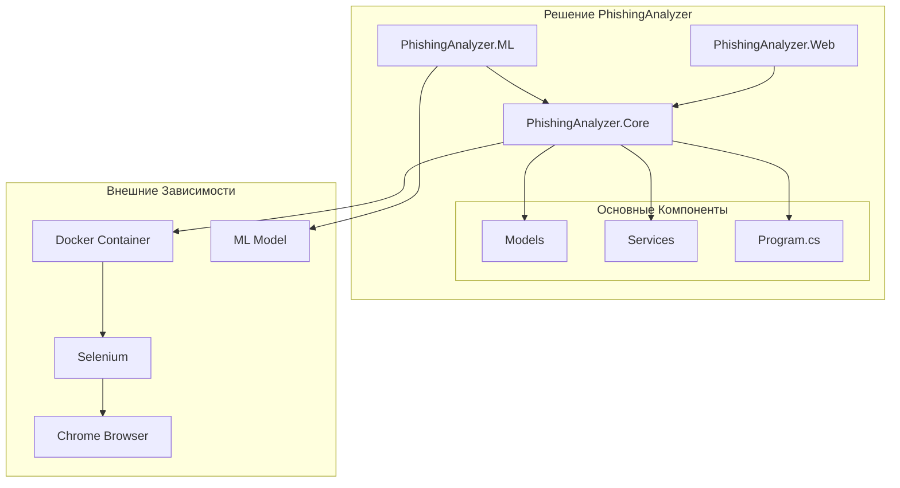

# Анализатор Фишинговых Сайтов

Комплексное .NET приложение для анализа веб-сайтов на предмет потенциальных фишинговых угроз с использованием нескольких методов анализа, включая машинное обучение, веб-скрапинг и обнаружение паттернов.

## Основные Возможности

- Анализ URL в изолированном Docker-контейнере
- Обнаружение фишинга на основе ML.NET с использованием алгоритма FastTree
- Обнаружение ошибок и предупреждений JavaScript
- Проверка HTTPS
- Обнаружение подозрительных паттернов (формы входа, редиректы и т.д.)
- Создание скриншотов
- Система оценки рисков
- Веб-интерфейс для удобного анализа
- RESTful API
- Расширяемая система анализа

## Компоненты Проекта

### PhishingAnalyzer.Core
Основной движок анализа, который предоставляет:
- Анализ содержимого веб-сайтов
- Обнаружение паттернов
- Оценку рисков
- Управление Docker-контейнерами
- Веб-скрапинг на основе Selenium
- Мониторинг веб-сайтов в реальном времени
- Извлечение и анализ контента
- Отслеживание сетевых запросов
- Проверку SSL-сертификатов

### PhishingAnalyzer.ML
Компонент машинного обучения на основе ML.NET, который предоставляет:
- Модель обнаружения фишинга на основе FastTree
- Комплексное извлечение признаков, включая:
  - Анализ структуры URL
  - Характеристики домена
  - Обнаружение подозрительных слов
  - Проверку протокола
  - Анализ TLD
  - Обнаружение IP-адресов
  - Анализ специальных символов
  - Анализ регистра букв
- Классификацию в реальном времени с вероятностными оценками
- Возможности обучения модели
- Поддержку обновления модели
- Анализ важности признаков
- Поддержку пакетного предсказания

#### Признаки Машинного Обучения
Компонент ML анализирует URL с использованием следующих признаков:
1. Базовые признаки URL:
   - Длина URL
   - Количество специальных символов
   - Количество цифр
   - Количество заглавных букв
   - Наличие подозрительных слов

2. Признаки структуры URL:
   - Проверка протокола
   - Проверка домена
   - Длина домена
   - Длина пути
   - Длина параметров запроса

3. Признаки безопасности:
   - Наличие IP-адреса
   - Обнаружение подозрительных TLD
   - Соотношение подозрительных слов
   - Безопасность протокола (HTTP vs HTTPS)

### PhishingAnalyzer.Web
Современный веб-интерфейс и API, который предоставляет:
- Пользовательский веб-интерфейс
- RESTful API
- Историю анализа
- Результаты анализа в реальном времени
- Пакетный анализ URL
- Интерактивную панель управления
- Подробные отчеты анализа
- Возможности экспорта
- Аутентификацию пользователей
- Управление API-ключами

## Требования

- .NET 9.0 SDK
- Docker Desktop
- Браузер Chrome (для локальной разработки)

## Установка

1. Клонируйте репозиторий
2. Установите Docker Desktop и убедитесь, что он запущен
3. Соберите решение:
   ```bash
   dotnet build
   ```

## Использование

### Интерфейс Командной Строки
Запустите анализатор из командной строки:
```bash
dotnet run --project PhishingAnalyzer.Core/PhishingAnalyzer.Core.csproj "https://example.com"
```

### Веб-Интерфейс
Запустите веб-приложение:
```bash
dotnet run --project PhishingAnalyzer.Web/PhishingAnalyzer.Web.csproj
```
Затем откройте веб-интерфейс по адресу `http://localhost:5000`

### API Endpoints
Доступны следующие RESTful endpoints:
- `POST /api/analyze` - Анализ одного URL
- `POST /api/analyze/batch` - Анализ нескольких URL
- `GET /api/history` - Получение истории анализа
- `GET /api/analysis/{id}` - Получение результатов конкретного анализа

## Критерии Анализа

Анализатор оценивает веб-сайты на основе нескольких факторов:

- Использование HTTPS
- Ошибки и предупреждения JavaScript
- Подозрительные паттерны (формы входа, редиректы)
- Источники скриптов
- Сетевые запросы
- Предсказания машинного обучения
- Возраст и регистрация домена
- Валидность SSL-сертификата
- Схожесть контента с известными фишинговыми сайтами

## Оценка Риска

Оценка риска рассчитывается на основе:

- Не-HTTPS соединение (30 баллов)
- Ошибки JavaScript (5 баллов каждая)
- Предупреждения (2 балла каждое)
- Подозрительные паттерны (10 баллов каждый)
- Предсказание ML-модели (0-100 баллов)
- Возраст домена < 1 год (15 баллов)
- Недействительный SSL-сертификат (25 баллов)
- Схожесть контента с известными фишинговыми сайтами (20 баллов)

Уровни риска:
- Низкий: < 30
- Средний: 30-59
- Высокий: 60-79
- Критический: ≥ 80

## Структура Проекта

```
PhishingAnalyzer/
├── PhishingAnalyzer.Core/         # Основной движок анализа
│   ├── Models/                    # Модели данных
│   ├── Services/                  # Сервисы анализа
│   └── Program.cs                 # Точка входа консольного приложения
├── PhishingAnalyzer.ML/          # Компонент ML на основе ML.NET
│   ├── Models/                    # ML модели
│   ├── Features/                  # Извлечение признаков
│   │   ├── UrlFeatures.cs        # Определения признаков URL
│   │   ├── UrlFeatureExtractor.cs # Логика извлечения признаков
│   │   └── UrlFeatureExtractionFactory.cs # Фабрика признаков
│   └── Services/                  # ML сервисы
├── PhishingAnalyzer.Web/         # Веб-интерфейс и API
│   ├── Controllers/              # API контроллеры
│   ├── Views/                    # Представления веб-интерфейса
│   └── wwwroot/                  # Статические файлы
└── phishing_model.zip            # Предварительно обученная ML модель
```

## Диаграмма Архитектуры



## Вклад в Проект

1. Форкните репозиторий
2. Создайте ветку для новой функциональности
3. Зафиксируйте ваши изменения
4. Отправьте изменения в ветку
5. Создайте Pull Request

## Лицензия

MIT License 